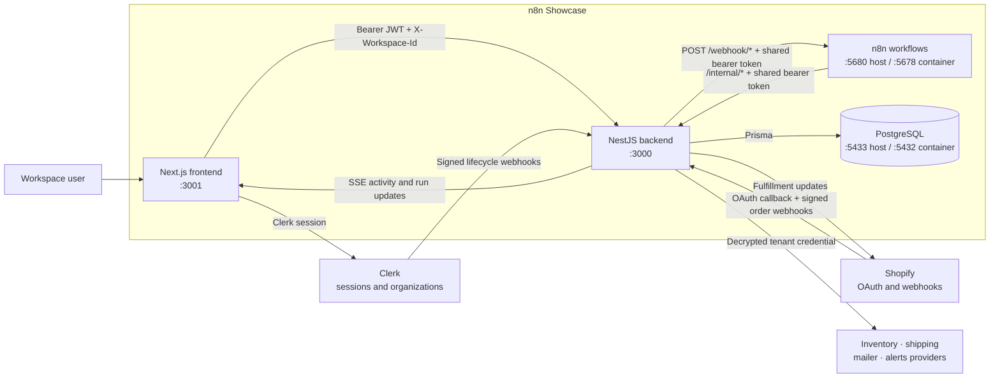
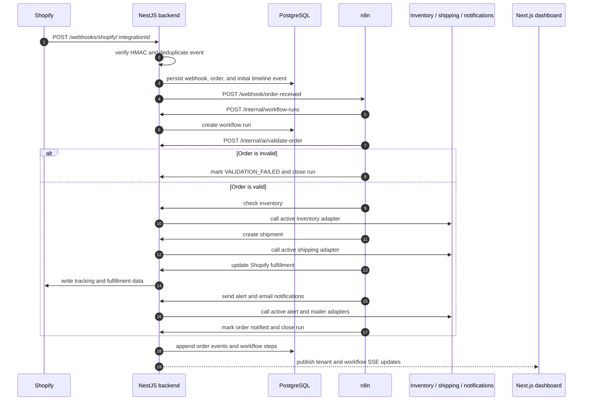
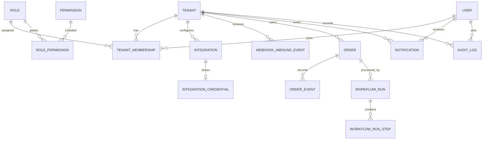

# n8n Showcase — Order Automation Platform

[](LICENSE)
[](https://nodejs.org/)

**n8n Showcase** is a demonstration project by [NUS Technology](https://www.nustechnology.com/) exploring multi-tenant e-commerce order automation, visual workflow orchestration, and resilient third-party integrations.

This repository contains the complete platform: it authenticates users and workspaces, ingests Shopify events, coordinates order validation, inventory checks, shipment creation, and customer notifications, tracks workflow execution, and provides operational visibility through a Next.js dashboard.

Automation is orchestrated through **n8n**. Durable application state lives in **PostgreSQL**, while **Clerk Organizations** provide workspace identity and the **NestJS** backend remains the trust boundary for authorization, credentials, provider calls, and audit behavior.

- **Company:** [NUS Technology](https://www.nustechnology.com/)
- **Labs:** [n8n Showcase — E-Commerce Order Automation](https://github.com/nustechnology/n8n-showcase)

## Table of contents

- [Tech stack](#tech-stack)
- [Getting started](#getting-started)
- [Environment configuration](#environment-configuration)
- [Project structure](#project-structure)
- [System architecture](#system-architecture)
- [Order automation flow](#order-automation-flow)
- [Authentication, tenant isolation, and RBAC](#authentication-tenant-isolation-and-rbac)
- [n8n workflow setup](#n8n-workflow-setup)
- [Runtime topology and ports](#runtime-topology-and-ports)
- [Data model](#data-model)
- [Main API routes](#main-api-routes)
- [Development commands](#development-commands)
- [Testing and CI](#testing-and-ci)
- [Project conventions](#project-conventions)
- [Troubleshooting](#troubleshooting)
- [License](#license)

---

## Tech stack

| Layer | Technology |
| --- | --- |
| Monorepo | npm workspaces + Turborepo |
| Frontend | Next.js 16, React 19, TypeScript, Tailwind CSS 4, shadcn/ui on Base UI |
| Frontend data | TanStack Query, Zustand, Zod, `@microsoft/fetch-event-source` |
| Backend | Node.js 22, NestJS 11, TypeScript, Zod |
| Authentication | Clerk sessions + Clerk Organizations |
| Authorization | Tenant membership, seeded RBAC permissions, and request-scoped CLS context |
| Database | PostgreSQL 16 + Prisma 5 |
| Workflow engine | n8n with exported JSON workflows |
| Integrations | Shopify, Zoho Inventory/Odoo, EasyPost/Shippo, Resend/SendGrid/Mailgun, Slack/Discord |
| Resilience | Request timeouts, rate limits, and circuit breakers with Opossum |
| Testing | Jest, ts-jest, Nock, Nest testing utilities |
| Runtime packaging | Docker + Docker Compose |

---

## Getting started

### Prerequisites

- Node.js 22 or newer
- npm 11 or newer; the repository pins `npm@11.16.0`
- Docker with Docker Compose
- A Clerk application with Organizations enabled
- A publicly reachable backend URL when testing Clerk or Shopify webhooks locally
- Provider accounts only for the integrations you want to exercise

Run npm commands from the monorepo root unless a section explicitly says otherwise.

### Install and configure

```bash
cd n8n-showcase

npm install
cp .env.example .env
```

Fill in `.env` before starting the applications. For host-based development, expose the same file at the locations read by NestJS/Prisma and Next.js:

```bash
ln -sf "$(pwd)/.env" apps/backend/.env
ln -sf "$(pwd)/.env" apps/frontend/.env.local
```

Do not commit `.env`, `.env.local`, provider tokens, Clerk secrets, or encryption keys.

### Local hybrid development

This mode runs PostgreSQL and n8n in Docker while the backend and frontend run on the host with hot reload.

The root Compose file is production-oriented (no bundled PostgreSQL, no host port binds — see [Full Docker stack](#full-docker-stack-production-vm)), so for local development run a standalone PostgreSQL yourself:

```bash
docker run -d --name n8n-showcase-dev-postgres \
  -e POSTGRES_USER=n8n-showcase -e POSTGRES_PASSWORD=<POSTGRES_PASSWORD> -e POSTGRES_DB=postgres \
  -p 127.0.0.1:5433:5432 postgres:16-alpine
```

Use host-reachable values in `.env`:

```env
DATABASE_URL="postgresql://n8n-showcase:<POSTGRES_PASSWORD>@localhost:5433/postgres"
N8N_BASE_URL="http://localhost:5680"
FRONTEND_URL="http://localhost:3001"
NEXT_PUBLIC_API_URL="http://localhost:3000"
```

Initialize the database, launch n8n, and start the applications:

```bash
# The app-specific Compose file runs n8n without pulling in any backend service.
docker compose -f apps/n8n/docker-compose.yml up -d

npm run db:generate
npm run db:migrate:deploy
npm run db:seed
npm run dev
```

Open the services:

- Frontend: [http://localhost:3001](http://localhost:3001)
- Backend health check: [http://localhost:3000/health](http://localhost:3000/health)
- n8n: [http://localhost:5680](http://localhost:5680)
- PostgreSQL: `localhost:5433`

Complete the [n8n workflow setup](#n8n-workflow-setup) before expecting Shopify events to run a workflow.

### Clerk provisioning

The backend does not expose a manual tenant-creation endpoint. Clerk webhooks provision and update tenants, users, and memberships.

1. Expose the backend through a local tunnel and set `APP_BASE_URL` to that public origin.
2. In the Clerk dashboard, create a webhook endpoint at `${APP_BASE_URL}/webhooks/clerk`.
3. Subscribe to organization, user, and organization-membership lifecycle events.
4. Copy the endpoint signing secret into `CLERK_WEBHOOK_SECRET`.
5. Apply migrations and seed the RBAC catalog before delivering or replaying Clerk events.

The first Clerk organization administrator is mapped to the system `Owner` role. Later organization administrators map to `Admin`; regular organization members map to `Operator`.

### Full Docker stack (production VM)

> To run the same all-in-Docker stack locally — bundled PostgreSQL, host port
> binds, private network — use [`docker-compose.local.yml`](docker-compose.local.yml):
> `docker compose -f docker-compose.local.yml up -d` (services at
> `:3000`/`:3001`/`:5680`/`:5433`). It runs its own `migrate` service on startup.

The root Compose file builds the backend and frontend and runs them alongside n8n as containers. It is designed for the shared-VM topology used by the other deployed projects:

- **No bundled PostgreSQL.** The stack reuses the shared PostgreSQL (`db`) from `~/srv/shared-services` on the external `shared-network`, with a dedicated `ecom_automation` role/database.
- **No host port binds.** Services only `expose` their ports on the Docker network. Public traffic enters through the shared nginx (see `deploy/nginx/ecom-automation.conf`), which maps `:5000` → backend, `:5001` → frontend, `:5678` → n8n.
- **A one-shot `migrate` service** applies Prisma migrations and seeds RBAC; the backend waits for it before starting.

Every service attaches to `shared-network` (external) so nginx and the shared database can reach it. For container-to-container connections, use service names in `.env`:

```env
ECOMPG_PASSWORD=<password for the shared ecom_automation db role>
DATABASE_URL="postgresql://ecom_automation:${ECOMPG_PASSWORD}@db:5432/ecom_automation?schema=public"
N8N_BASE_URL="http://ecom-automation-n8n:5678"
APP_BASE_URL="http://ecom-automation.nustechnology.com:5000"
FRONTEND_URL="http://ecom-automation.nustechnology.com:5001"
NEXT_PUBLIC_API_URL="http://ecom-automation.nustechnology.com:5000"
```

Provision the dedicated database role/`ecom_automation` database on the shared PostgreSQL first (see `deploy/postgres/02-ecom-automation.sql`), then start the stack. The `migrate` service runs migrations + seed automatically on startup:

```bash
npm run docker:build
npm run docker:up
docker compose ps          # confirm migrate exited 0 and the rest are healthy
npm run docker:logs
```

Public entry points (served by shared nginx):

- Frontend: [http://ecom-automation.nustechnology.com:5001](http://ecom-automation.nustechnology.com:5001)
- Backend health check: [http://ecom-automation.nustechnology.com:5000/health](http://ecom-automation.nustechnology.com:5000/health)
- n8n: [http://ecom-automation.nustechnology.com:5678](http://ecom-automation.nustechnology.com:5678)

Stop the complete stack with:

```bash
npm run docker:down
```

---

## Environment configuration

All checked-in configuration keys are documented in `.env.example`. Docker Compose reads the root `.env`; host development uses the symlinks created during setup.

| Variable | Used by | Purpose |
| --- | --- | --- |
| `ECOMPG_PASSWORD` | Backend, migrate | Password for the shared `ecom_automation` PostgreSQL role |
| `DATABASE_URL` | Backend, Prisma | PostgreSQL connection string; hostname differs between host and Docker modes |
| `CLERK_ISSUER` | Backend | Clerk issuer used to discover JWKS and verify session tokens |
| `CLERK_SECRET_KEY` | Backend, frontend | Clerk server-side API key |
| `CLERK_WEBHOOK_SECRET` | Backend | Svix signing secret for Clerk webhook verification |
| `CREDENTIALS_ENCRYPTION_KEY` | Backend | Base64-encoded 32-byte key for AES-256-GCM integration credentials |
| `APP_BASE_URL` | Backend | Public backend origin used for OAuth callbacks and webhook registration |
| `FRONTEND_URL` | Backend | Exact CORS origin and post-OAuth redirect origin |
| `N8N_BASE_URL` | Backend | n8n origin reached by the backend |
| `N8N_INTERNAL_TOKEN` | Backend, n8n | Shared bearer token for backend-to-n8n and n8n-to-backend calls |
| `SHOPIFY_CLIENT_ID` / `SHOPIFY_CLIENT_SECRET` | Backend | Shopify OAuth application credentials |
| `SHOPIFY_SCOPES` | Backend | Shopify scopes requested during OAuth |
| `ZOHO_CLIENT_ID` / `ZOHO_CLIENT_SECRET` | Backend | Zoho OAuth application credentials |
| `NEXT_PUBLIC_CLERK_PUBLISHABLE_KEY` | Frontend | Browser-safe Clerk publishable key |
| `NEXT_PUBLIC_API_URL` | Frontend | Browser-reachable backend origin |
| `NEXT_PUBLIC_CLERK_*` | Frontend | Sign-in, sign-up, and fallback redirect paths |
| `NEXT_PUBLIC_GEOAPIFY_API_KEY` | Frontend | Optional address autocomplete key |
| `N8N_ENCRYPTION_KEY` | n8n | Encrypts n8n-owned credentials at rest |
| `N8N_API_KEY` | n8n tooling | Optional n8n API key for administrative automation |

Generate secrets instead of inventing them manually:

```bash
openssl rand -base64 32 # CREDENTIALS_ENCRYPTION_KEY
openssl rand -hex 32    # N8N_INTERNAL_TOKEN and N8N_ENCRYPTION_KEY
```

An empty optional provider credential keeps that integration unavailable; it should never be replaced with a production secret in a committed file.

---

## Project structure

```text
.
├── apps/
│   ├── backend/                    # NestJS API
│   │   ├── prisma/                 # Prisma schema, migrations, seed, Clerk sync utility
│   │   ├── src/
│   │   │   ├── auth/               # Clerk verification, tenant guard, RBAC guard
│   │   │   ├── integrations/       # Provider adapters and encrypted credential access
│   │   │   ├── internal/           # n8n callback API and workflow trigger service
│   │   │   ├── orders/             # Orders and order timeline
│   │   │   ├── tenants/            # Workspaces, members, and activity SSE
│   │   │   ├── workflow-runs/      # Run history, retry, and run SSE
│   │   │   ├── webhooks/           # Clerk and Shopify webhook ingestion
│   │   │   └── ...                 # Audit log, notifications, health, realtime, Prisma
│   │   └── Dockerfile
│   ├── frontend/                   # Next.js App Router dashboard
│   │   ├── app/                    # Auth, onboarding, workspace, order, workflow pages
│   │   ├── components/             # UI primitives, patterns, and domain components
│   │   ├── features/               # API/query modules by domain
│   │   ├── hooks/                  # Authenticated API and SSE hooks
│   │   ├── lib/                    # Shared frontend utilities and workflow fixtures
│   │   └── Dockerfile
│   └── n8n/
│       ├── workflows/
│       │   ├── order-validation.json
│       │   └── cart-reminder.json
│       └── docker-compose.yml       # n8n-only Compose for hybrid development
├── packages/
│   ├── shared-schemas/             # Shared Zod schemas and DTO contracts
│   ├── shared-types/               # Shared TypeScript interfaces
│   └── shared-config/              # Base TypeScript configuration
├── .github/workflows/ci.yml
├── .env.example
├── docker-compose.yml              # Full-stack orchestration
├── package.json                    # npm workspaces and root commands
└── turbo.json                      # Turborepo task graph
```

---

## System architecture



The trust boundaries are deliberate:

- The browser authenticates with Clerk; the backend does not trust a workspace header without a matching verified Clerk `org_id` claim.
- Provider callbacks and webhooks are public routes, but their provider-specific signatures and state are verified by the backend.
- n8n has one shared internal-service token. It sends tenant and order identifiers to backend endpoints but never receives decrypted tenant credentials.
- PostgreSQL is accessed only by the backend through Prisma.

---

## Order automation flow

The `Order Validation` workflow is a fulfillment pipeline, not only a validation check.



Inventory, shipment creation, and Shopify update failures stop the order workflow and mark it failed. Alert delivery is designed as a best-effort step so an alert-provider outage does not invalidate an otherwise successful fulfillment. Workflow run steps and the append-only order timeline preserve the operational history shown in the dashboard.

The second exported workflow, `Cart Reminder`, receives checkout events, waits two minutes in the demo workflow, checks whether the checkout became an order, and sends a reminder through the configured alert provider when it did not.

---

## Authentication, tenant isolation, and RBAC

### Request authentication

NestJS registers global guards in this order:

1. `ClerkTenantGuard` verifies the bearer token, requires an active Clerk organization, compares `X-Workspace-Id` with the verified `org_id`, resolves the tenant and user, and writes their IDs into request-scoped CLS context.
2. `TenantThrottlerGuard` rate-limits authenticated tenant traffic.
3. `PermissionsGuard` enforces `@RequirePermission("resource:action")` metadata when a route declares it.

Routes marked `@Public()` bypass the Clerk guards. Health checks need no secondary authentication; Clerk and Shopify endpoints verify provider signatures; internal n8n controllers use `InternalAuthGuard` and `N8N_INTERNAL_TOKEN`.

### Tenant isolation

Tenant isolation is application-level. PostgreSQL Row-Level Security is not configured, so every tenant-scoped Prisma read and write must explicitly filter by `tenantId`. The verified Clerk organization claim—not a request body, path parameter, or header by itself—is the source of tenant identity for browser-facing routes.

### System roles

`npm run db:seed` creates the permission catalog and four system roles:

| Role | Intended access |
| --- | --- |
| Owner | Full tenant, member, integration, order, billing, and audit access |
| Admin | Member, integration, order, billing-read, and audit access; no billing management |
| Operator | Day-to-day order operations, integration testing, and read access |
| Viewer | Read-only access to members, integrations, and orders |

---

## n8n workflow setup

The exported JSON files under `apps/n8n/workflows/` are the source of truth. Both exports are intentionally inactive and must be imported, configured, and activated in the target n8n instance.

1. Open [http://localhost:5680](http://localhost:5680) and complete the n8n owner setup.
2. Create a Header Auth credential:
   - Name: `Backend Internal Token`
   - Header: `Authorization`
   - Value: `Bearer <N8N_INTERNAL_TOKEN>`
3. Import `apps/n8n/workflows/order-validation.json` and `apps/n8n/workflows/cart-reminder.json` through **Import from File**.
4. Confirm that both Webhook nodes and all HTTP Request nodes use the `Backend Internal Token` credential.
5. Set backend URLs in the HTTP Request nodes for the selected runtime:
   - Hybrid development: `http://host.docker.internal:3000`
   - Full root Compose stack: `http://ecom-automation-backend:3000`
6. In the current `order-validation.json` export, change the `Notify Email` node path from `/internal/integrations/resend/send-email` to the backend's current generic route, `/internal/integrations/mailer/send-email`.
7. Activate the workflows so their production webhook URLs exist:
   - `POST /webhook/order-received`
   - `POST /webhook/cart-reminder`

The backend must use the matching n8n address:

- Hybrid development: `N8N_BASE_URL=http://localhost:5680`
- Full Compose stack: `N8N_BASE_URL=http://ecom-automation-n8n:5678`

When a workflow changes in the n8n UI, export it through the workflow menu and overwrite its JSON file under `apps/n8n/workflows/`. Treat the live n8n copy as an editor, not the repository source of truth.

---

## Runtime topology and ports

In the production VM, the three app containers expose their ports only on the Docker network; the shared nginx binds the public host ports and proxies to them:

| Public host port | Container port | Service | Purpose |
| --- | --- | --- | --- |
| `5000` | `3000` | `ecom-automation-backend` | REST API, webhooks, internal API, and SSE |
| `5001` | `3001` | `ecom-automation-frontend` | Tenant dashboard and onboarding |
| `5678` | `5678` | `ecom-automation-n8n` | Workflow editor and webhook triggers |

The database is not part of this stack — it is the shared PostgreSQL from `~/srv/shared-services` (`db`), reused across every deployed project.

Docker networking uses service names instead of host ports:

| Caller | Target URL |
| --- | --- |
| Backend container | `http://ecom-automation-n8n:5678` |
| n8n container | `http://ecom-automation-backend:3000` |
| Backend container | `db:5432` through `DATABASE_URL` |
| Browser | `http://ecom-automation.nustechnology.com:5000` and `:5001` (via shared nginx) |

Quick checks:

```bash
curl http://ecom-automation.nustechnology.com:5000/health
docker compose ps
docker compose logs ecom-automation-backend ecom-automation-n8n
```

---

## Data model

The Prisma schema separates identity and authorization, provider credentials, webhook ingestion, order history, workflow execution, notifications, and audit records.



| Model group | Responsibility |
| --- | --- |
| `Tenant`, `User`, `TenantMembership` | Clerk-backed workspace identity and membership |
| `Role`, `Permission`, `RolePermission` | Seeded application RBAC matrix |
| `Integration`, `IntegrationCredential` | Provider state plus AES-256-GCM ciphertext stored separately from display configuration |
| `WebhookInboundEvent` | Signature result, deduplication identity, payload, and processing state |
| `Order`, `OrderEvent` | Current order projection and append-only operational timeline |
| `WorkflowRun`, `WorkflowRunStep` | n8n execution state, retry metadata, and per-step progress |
| `Notification` | User-scoped notification center entries |
| `AuditLog` | Tenant-scoped actor and change history |

---

## Main API routes

The backend has no global `/api` prefix. Paths below are rooted directly at the backend origin.

### Public and provider-authenticated routes

| Method | Path | Authentication | Purpose |
| --- | --- | --- | --- |
| `GET` | `/health` | Public | Check the API and PostgreSQL connection |
| `POST` | `/webhooks/clerk` | Svix signature | Provision Clerk organizations, users, and memberships |
| `POST` | `/webhooks/shopify/:integrationId` | Shopify webhook HMAC | Ingest Shopify order events |
| `POST` | `/webhooks/shopify/:integrationId/checkout` | Shopify webhook HMAC | Trigger the cart-reminder flow for checkout events |
| `GET` | `/integrations/:provider/callback` | Provider callback state/signature | Complete supported OAuth connections |

### Clerk-authenticated tenant routes

These routes require `Authorization: Bearer <Clerk session token>` and `X-Workspace-Id: <Clerk organization ID>`. Individual routes may require an RBAC permission.

| Method | Path | Purpose |
| --- | --- | --- |
| `GET`, `PATCH` | `/tenants/me` | Read or update the active workspace |
| `GET` (SSE) | `/tenants/:clerkOrgId/activity/stream` | Stream workspace activity |
| `GET` | `/tenants/me/members` | List workspace members |
| `POST` | `/tenants/me/invitations` | Invite a member |
| `PATCH`, `DELETE` | `/tenants/me/members/:membershipId` | Change a role or remove a member |
| `GET` | `/integrations` | List integration state for the tenant |
| `POST` | `/integrations/:provider/connect` | Start OAuth or save an API-key integration |
| `POST` | `/integrations/:provider/test` | Test a configured integration |
| `DELETE` | `/integrations/:provider` | Disconnect an integration |
| `GET` | `/orders` | List tenant orders |
| `GET` | `/orders/:id` | Get one tenant order |
| `GET` | `/orders/:id/timeline` | Read the order event timeline |
| `PATCH` | `/orders/:id/status` | Override order status |
| `GET` | `/workflow-runs` | List workflow runs |
| `GET` | `/workflow-runs/:id` | Get a workflow run and its steps |
| `POST` | `/workflow-runs/:id/retry` | Retry a failed run |
| `GET` (SSE) | `/workflow-runs/:id/stream` | Stream run updates |
| `GET` | `/notifications` | List notifications for the current user |
| `PATCH` | `/notifications/:id/read` | Mark one notification as read |
| `GET` | `/audit-logs` | List tenant audit records |

### n8n internal routes

These routes are not Clerk-authenticated. They require `Authorization: Bearer <N8N_INTERNAL_TOKEN>` and are rate-limited as machine-to-machine calls.

| Method | Path | Purpose |
| --- | --- | --- |
| `POST` | `/internal/workflow-runs` | Open a workflow run |
| `PATCH` | `/internal/workflow-runs/:id` | Update or close a run |
| `POST` | `/internal/workflow-runs/:id/steps` | Create or update a named run step |
| `POST` | `/internal/ai/validate-order` | Validate persisted order fields |
| `PATCH` | `/internal/orders/:id/status` | Advance or fail an order |
| `POST` | `/internal/orders/:id/events` | Append an order timeline event |
| `POST` | `/internal/integrations/inventory/check-inventory` | Call the active inventory provider |
| `POST` | `/internal/integrations/shipping/create-shipment` | Call the active shipping provider |
| `POST` | `/internal/integrations/shopify/update-order` | Update Shopify fulfillment data |
| `POST` | `/internal/integrations/alerts/send-message` | Send through the active alert provider |
| `POST` | `/internal/integrations/mailer/send-email` | Send through the active mailer provider |
| `POST` | `/internal/integrations/shopify/check-checkout-order` | Resolve whether a checkout became an order |

Provider-specific aliases for Zoho, EasyPost, and Slack also exist for compatibility with exported workflow versions; new workflows should prefer the generic inventory, shipping, alert, and mailer routes. The old `/internal/integrations/resend/send-email` path is not an alias and must be updated during import as described in [n8n workflow setup](#n8n-workflow-setup).

---

## Development commands

Run these commands from the monorepo root.

| Command | Purpose |
| --- | --- |
| `npm run dev` | Run workspace development tasks through Turborepo |
| `npm run build` | Build applications and shared packages in dependency order |
| `npm run typecheck` | Type-check all workspaces |
| `npm run lint` | Run workspace ESLint tasks |
| `npm test` | Run all workspace test tasks once |
| `npm run db:generate` | Regenerate the Prisma client |
| `npm run db:migrate:deploy` | Apply committed Prisma migrations |
| `npm run db:seed` | Seed system roles and permissions |
| `npm run db:studio` | Open Prisma Studio |
| `npm run docker:build` | Build backend and frontend images |
| `npm run docker:up` | Start the root Compose stack in the background |
| `npm run docker:down` | Stop the root Compose stack |
| `npm run docker:logs` | Follow logs for the root Compose stack |
| `npm run codegen:api` | Generate frontend API types when the configured backend exposes `openapi.json` |

Filter a task to one workspace when needed:

```bash
npx turbo dev --filter=@n8n-showcase/backend
npx turbo test --filter=@n8n-showcase/backend
npx turbo build --filter=@n8n-showcase/frontend
```

After changing `apps/backend/prisma/schema.prisma`, regenerate the Prisma client. Create development migrations from the backend directory only when intentionally authoring a new migration:

```bash
cd apps/backend
npx prisma migrate dev --name <migration-name>
```

Return to the monorepo root before running npm scripts again.

---

## Testing and CI

Backend unit tests use Jest and ts-jest. External HTTP behavior is isolated with Nock, and Nest testing utilities construct feature modules and guards. The frontend currently declares a placeholder test task, so `npm test` primarily exercises backend tests while preserving a monorepo-wide test command.

```bash
npm test
npm run typecheck
npm run lint
npm run build
```

`.github/workflows/ci.yml` runs on pushes and pull requests to `main`:

| Job | Behavior |
| --- | --- |
| `typecheck` | Install dependencies, generate Prisma, and type-check all workspaces |
| `lint` | Generate Prisma and run workspace lint; lint is currently configured with `continue-on-error` |
| `test` | Start PostgreSQL, generate Prisma, and run the Turborepo test graph |
| `build` | Build after typecheck, lint, and test jobs finish |

CI uses Node.js 22 and PostgreSQL 16.

---

## Project conventions

- Run npm commands from the monorepo root. Use workspace flags or Turborepo filters instead of installing or running from an app directory.
- Put shared Zod request/response contracts in `packages/shared-schemas/src/` and re-export them from its `index.ts`.
- Keep shared TypeScript interfaces in `packages/shared-types/`; each consuming app must declare its shared-package dependency.
- Use per-route `ZodValidationPipe` validation. The backend does not register a global class-validator pipe.
- Mark unauthenticated routes explicitly with `@Public()` and provide the appropriate provider-signature or internal-service authentication where required.
- Include `tenantId` in every tenant-scoped Prisma query. Application review is the current isolation backstop.
- Keep secret integration credentials in `IntegrationCredential`; n8n workflow JSON must not contain provider tokens.
- Treat `OrderEvent` as the append-only timeline and `WorkflowRunStep` as the mutable execution projection shown by the stepper UI.
- Export every n8n UI change back into `apps/n8n/workflows/` and review the JSON before committing it.
- Make focused changes that preserve existing app boundaries and avoid unrelated refactors.

---

## Troubleshooting

### Backend exits during startup

Check `.env` and `apps/backend/.env`. The backend reads configuration at startup and fails when required keys such as `DATABASE_URL`, `CLERK_ISSUER`, `CLERK_SECRET_KEY`, `CLERK_WEBHOOK_SECRET`, `CREDENTIALS_ENCRYPTION_KEY`, `APP_BASE_URL`, `FRONTEND_URL`, `N8N_BASE_URL`, or `N8N_INTERNAL_TOKEN` are unavailable.

`CREDENTIALS_ENCRYPTION_KEY` must decode to exactly 32 bytes:

```bash
openssl rand -base64 32
```

### Prisma cannot reach PostgreSQL

Use the hostname for the process making the connection:

- Host npm/Prisma process (local dev): `localhost:5433`
- Backend container (production VM): `db:5432` (the shared PostgreSQL service name)

Then regenerate and migrate:

```bash
npm run db:generate
npm run db:migrate:deploy
npm run db:seed
```

If Prisma reports that a table does not exist, migrations have not been applied to the database selected by the current `DATABASE_URL`.

### A dashboard request returns 400, 401, or 403

- `401`: verify the frontend sent a current Clerk bearer token.
- `400`: ensure `X-Workspace-Id` is present and exactly matches the token's active `org_id`.
- `403 Workspace is not provisioned`: verify the Clerk webhook URL and signing secret, then replay the missing organization, user, or membership events from Clerk after migrations and seeding complete.
- Permission-specific `403`: confirm the active membership and seeded role contain the route's required permission.

### Clerk or Shopify rejects a webhook signature

Confirm the signing secret belongs to the exact configured endpoint and that no proxy rewrites the request body. Clerk verification uses the raw Svix-signed bytes; Shopify webhook verification uses its webhook HMAC. `APP_BASE_URL` must match the public tunnel or deployment origin used by provider configuration.

### A Shopify integration becomes `DEGRADED`

The OAuth credential may be valid while webhook registration failed. Inspect the integration's `lastErrorMessage`, confirm the requested scopes and protected customer-data access in Shopify, then disconnect and reconnect to retry webhook registration.

### The backend cannot start an n8n workflow

Check all of the following:

- the workflow is imported and active;
- its Webhook node uses Header Auth;
- `N8N_BASE_URL` is `http://localhost:5680` from a host backend or `http://ecom-automation-n8n:5678` from the backend container; and
- the n8n credential and backend use the same `N8N_INTERNAL_TOKEN`.

### n8n cannot call the backend

Use `http://host.docker.internal:3000` when NestJS runs on the host, or `http://ecom-automation-backend:3000` when both services run in the root Compose stack. `localhost:3000` inside the n8n container points back to the n8n container, not to NestJS.

### A port is already in use

In the production VM the app containers bind **no host ports** — they only `expose` ports on the Docker network, so they never collide with other projects (roomscan on `:4000`, folio on `:3000`). Public host ports are owned by the shared nginx in `~/srv/shared-services`:

- `5000`, `5001`, `5678` (this project's nginx `server` blocks).

If a public port is already in use, change the matching `ports:` entry in `~/srv/shared-services/docker-compose.yml` and the `listen` directive in `deploy/nginx/ecom-automation.conf`, then restart nginx.

For host-based local development, the old standalone stack bound `127.0.0.1:3000`/`3001`/`5680`/`5433`; stop the conflicting local process or change the corresponding host-side port there.

---

## License

This project is licensed under the [NUS Technology Non-Commercial License 1.0](LICENSE). Commercial use and redistribution are not permitted. For commercial licensing, contact [NUS Technology](https://www.nustechnology.com/).
